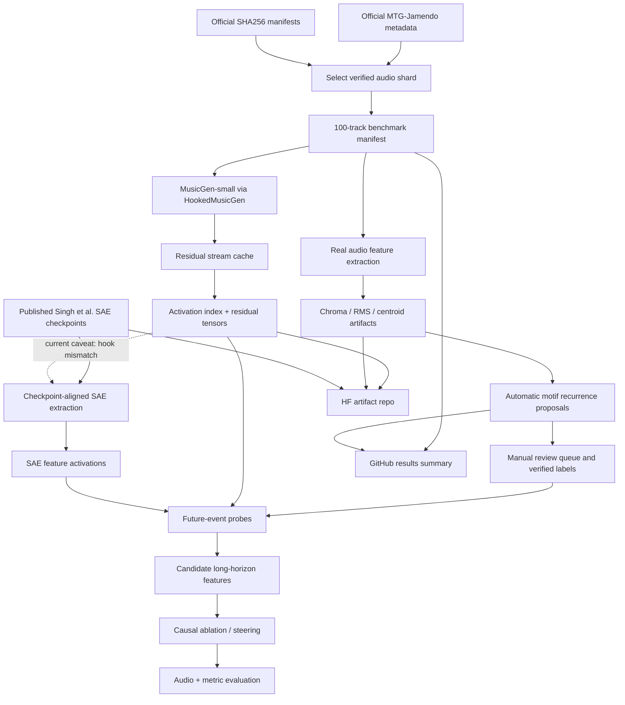

# MusicGen Long-Horizon Coherence Experiment

Classic mechanistic interpretability study of whether autoregressive music models contain internal features that predict and potentially control long-horizon musical structure.

Public framing:

> Do autoregressive music models have foresight-like coherence features?

This repository builds on the MusicGen sparse-autoencoder workflow from [PapayaResearch/musicdiscovery](https://github.com/PapayaResearch/musicdiscovery), associated with Singh et al., [Discovering and Steering Interpretable Concepts in Large Generative Music Models](https://arxiv.org/abs/2505.18186). It extends that setup toward future-event probes, real-audio motif recurrence benchmarks, and causal feature intervention experiments.

This project follows a strict [real-data-only policy](docs/data-policy.md): no fake benchmark records, synthetic motif labels, placeholder annotations, or fake model outputs are allowed as experiment evidence.

## Research Question

Do MusicGen residual-stream or SAE features encode information about future musical structure, especially motif recurrence, beyond local texture, position, loudness, or genre shortcuts?

The strong version of the hypothesis is causal:

- At time `t`, some internal feature predicts a musically meaningful event at `t + delta`, where `delta` is long enough that the event is not just local continuation.
- Ablating or scaling that feature changes the future event more than it changes local audio quality.
- The effect survives controls for position, acoustic statistics, prompt/source metadata, and short-horizon fluency.

A negative result is also useful: if probes and interventions fail under clean controls, that is evidence against simple "foresight circuit" stories in this setting.

## Current Status

Status: **partial real RunPod execution complete; no manual-label probe result yet**.

Completed on 2026-05-06:

- Verified one official MTG-Jamendo low-audio shard against its SHA256 tar checksum.
- Verified 202 unpacked MP3 files against official track SHA256 hashes.
- Built a 100-track benchmark manifest using only physically present, verified, instrument-labeled audio.
- Ran `facebook/musicgen-small` through the `musicdiscovery` TransformerLens-style `HookedMusicGen` wrapper.
- Extracted 500 residual-stream tensors for 100 real tracks across five MusicGen hooks.
- Extracted 100 real-audio chroma feature artifacts.
- Produced 98 automatic motif-recurrence proposal rows and 2 logged recurrence failures.
- Downloaded real published Singh et al. MusicGen-small SAE checkpoints.
- Uploaded heavy artifacts to a private Hugging Face dataset repo.

Important caveat:

The completed residual run used pilot hooks `hook_layers.2`, `hook_layers.6`, `hook_layers.12`, `hook_layers.18`, and `hook_layers.22`. The downloaded published SAE checkpoints target `hook_layers.1`, `hook_layers.5`, `hook_layers.11`, `hook_layers.17`, and `hook_layers.21`. Do **not** mix these as SAE-aligned activations. The next rigorous step is to rerun residual/SAE extraction on the checkpoint-aligned hooks.

## Artifact Links

GitHub-safe run summary:

- [Run summary](results/runpod-2026-05-06/README.md)
- [Machine-readable summary](results/runpod-2026-05-06/summary.json)
- [Benchmark manifest](results/runpod-2026-05-06/data/benchmark_manifest.jsonl)
- [Activation index](results/runpod-2026-05-06/indexes/activation_index.jsonl)
- [Recurrence proposals](results/runpod-2026-05-06/data/recurrence_proposals.jsonl)
- [Recurrence failures](results/runpod-2026-05-06/data/recurrence_failures.jsonl)
- [Run logs](results/runpod-2026-05-06/logs/)
- [SAE checkpoint configs](results/runpod-2026-05-06/checkpoints/)

Heavy Hugging Face artifacts:

- [HF dataset root](https://huggingface.co/datasets/Perfect7613/musicgen-exp-runpod-results)
- [Residual activation dump](https://huggingface.co/datasets/Perfect7613/musicgen-exp-runpod-results/tree/main/activations_full)
- [Metadata and logs](https://huggingface.co/datasets/Perfect7613/musicgen-exp-runpod-results/tree/main/metadata)
- [Chroma feature artifacts](https://huggingface.co/datasets/Perfect7613/musicgen-exp-runpod-results/tree/main/features)
- [Published SAE checkpoint bundle](https://huggingface.co/datasets/Perfect7613/musicgen-exp-runpod-results/tree/main/sae_checkpoints)

Primary references:

- [Singh et al. paper](https://arxiv.org/abs/2505.18186)
- [musicdiscovery repository](https://github.com/PapayaResearch/musicdiscovery)
- [MTG-Jamendo dataset repository](https://github.com/MTG/mtg-jamendo-dataset)
- [MusicGen / Audiocraft](https://github.com/facebookresearch/audiocraft)

## Architecture



## Evidence Standard

A feature only counts as a candidate long-horizon coherence feature if it passes all of these checks:

- It predicts held-out future recurrence better than position/acoustic/source controls.
- It is stronger at long horizons than short local horizons.
- It has a causal effect under ablation or scaling.
- The effect is specific to future structure, not just broad audio degradation.
- The feature remains interpretable enough to audit with examples.

Current results do **not** yet establish such a feature. They establish the real-data pipeline and produce the first serious activation/artifact dump.

## Repository Layout

```text
configs/              Experiment configs
data/annotations/     Annotation examples and generated review artifacts
docs/                 Project plan, data policy, RunPod workflow, method notes
notebooks/            Exploratory notebooks
outputs/              Local/generated run artifacts, ignored where appropriate
results/              GitHub-safe run summaries and manifests
schemas/              JSON schemas for benchmark annotations
scripts/              CLI entrypoints for each pipeline stage
src/musicgen_exp/     Reusable experiment code
tests/                Unit tests and guardrails
```

## Quick Start

```bash
uv sync --extra dev
uv run python scripts/validate_annotations.py --schema-only
uv run python scripts/validate_config.py --config configs/experiment.yaml
uv run pytest
```

Build a benchmark manifest only after downloading official MTG-Jamendo metadata and license files:

```bash
uv run python scripts/build_benchmark_manifest.py \
  --metadata-tsv /path/to/mtg-jamendo-dataset/data/autotagging_instrument.tsv \
  --audio-licenses /path/to/mtg-jamendo-dataset/audio_licenses.txt \
  --audio-root /path/to/unpacked/audio-low \
  --audio-variant audio-low \
  --output data/benchmark_manifest.jsonl
```

Extract MusicGen activations on RunPod after cloning `musicdiscovery` and installing model dependencies:

```bash
PYTHONPATH=/workspace/musicgen-exp/src:/workspace/musicdiscovery \
python scripts/extract_musicgen_activations.py \
  --manifest data/benchmark_manifest.jsonl \
  --audio-root /workspace/mtg-jamendo-audio-low/unpacked \
  --output-dir outputs/activations_full \
  --musicdiscovery-path /workspace/musicdiscovery \
  --model-size pilot \
  --mode teacher-forced \
  --device cuda \
  --limit 100
```

Extract real-audio recurrence proposals:

```bash
PYTHONPATH=src python scripts/extract_motif_features.py \
  --manifest data/benchmark_manifest.jsonl \
  --audio-root /path/to/unpacked/audio-low \
  --features-dir outputs/features \
  --proposals data/recurrence_proposals.jsonl \
  --failures data/recurrence_failures.jsonl \
  --limit 100
```

## Next Rigorous Steps

1. Rerun activation extraction on SAE checkpoint-aligned hooks: `1`, `5`, `11`, `17`, `21`.
2. Encode those aligned residuals with the published SAE checkpoints.
3. Manually verify recurrence proposals into positive, negative, ambiguous, and rejected labels.
4. Train future-event probes only on verified labels.
5. Compare against position-only, acoustic-only, source/prompt-only, shuffled-label, and local-horizon controls.
6. Run feature ablation/scaling experiments on the strongest candidates.
7. Report positive or null results without hiding the layer-mismatch and labeling caveats.

## Documentation

- [Data policy](docs/data-policy.md)
- [Benchmark construction](docs/benchmark.md)
- [Audio features](docs/audio-features.md)
- [Annotation workflow](docs/annotations.md)
- [MusicGen integration](docs/musicgen-integration.md)
- [Probe design](docs/probes.md)
- [SAE interventions](docs/interventions.md)
- [Evaluation dashboards](docs/evaluation.md)
- [RunPod setup](docs/runpod.md)
- [Budget-aware full workflow](docs/runpod-full-study.md)
